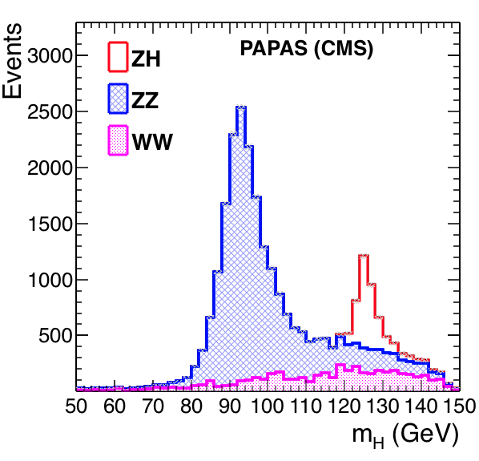
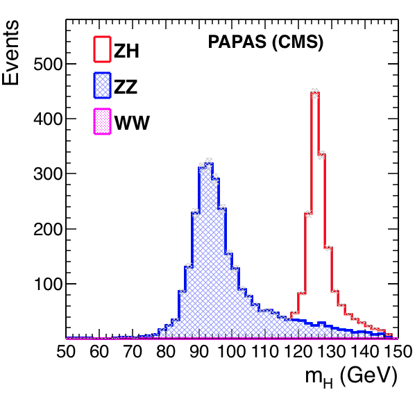

# Jan30, CMS

[Analysis code](https://github.com/cbernet/fcc-ee-higgs/blob/84ad765f3f9fc390283e9fa62f4c328829df5531/analysis_ee_ZH_llbb.py)

|Sample name |
|---|
|`heppy/ee_to_ZH_Z_to_ll/CMS/Jan30/ee_to_WW_Dec6_large` |
|`heppy/ee_to_ZH_Z_to_ll/CMS/Jan30/ee_to_ZH_Oct30` |
|`heppy/ee_to_ZH_Z_to_ll/CMS/Jan30/ee_to_ZZ_Sep12_A_2` |

## H->ZH->llX

3.1%

## H->ZH->llbb

3.0%

